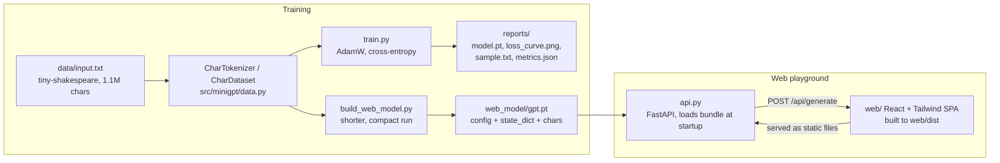

# Tiny GPT

A character-level GPT built from scratch in PyTorch — hand-written multi-head causal self-attention (no `nn.MultiheadAttention`), trained on Shakespeare, with a web playground to try it live.


> **AI Engineer Roadmap — Project 3.2**
> *Teaches: attention mechanics, why LLMs work, the actual architecture instead of the metaphor.*
> *Done when: you can explain self-attention to someone without using the word "magic."*

## What it does

`src/minigpt` implements a small GPT-style transformer entirely from primitives (`nn.Linear`, `nn.LayerNorm`, `nn.Embedding`) — multi-head causal self-attention, learned positional embeddings, pre-norm residual blocks, and weight tying between the input embedding and output head. It trains on the public-domain [tiny-shakespeare](https://github.com/karpathy/char-rnn) corpus at the character level and generates Shakespeare-*shaped* text.

A small FastAPI + React "playground" (`api.py` + `web/`) loads a pre-trained, committed checkpoint (`web_model/gpt.pt`) so you can generate text from a browser with no training or GPU required.

This is an educational / portfolio project, not a production LLM — see [Limitations](#limitations).

## Architecture



The model itself (`src/minigpt/model.py`):

```
GPT
├── token embedding  +  positional embedding
├── N x Block
│    ├── LayerNorm -> CausalSelfAttention -> + residual
│    └── LayerNorm -> MLP (4x, GELU)       -> + residual
├── final LayerNorm
└── linear head  (weights tied to token embedding)
```

### Self-attention without the word "magic"

For every token, three vectors are produced by linear projection:

- **query (q)** — *what am I looking for?*
- **key (k)** — *what do I offer?*
- **value (v)** — *what will I contribute if attended to?*

The score from token *i* to token *j* is the dot product `q_i · k_j` — how well *i*'s query matches *j*'s key. Then:

1. **Scale** by `1/√(head_dim)` so scores don't grow with dimension.
2. **Causal mask**: set scores for future tokens (`j > i`) to `−∞`, so a token can only look backward — essential for next-token prediction.
3. **Softmax** over *j* → attention weights that sum to 1.
4. **Weighted sum of values** → each token's new representation mixes in the earlier tokens it found relevant.

Run several of these in parallel (**heads**) and stack several **layers**, with an MLP and residual connections in between, and that is a GPT. `src/minigpt/model.py` is annotated line-by-line to match this description.

**Positional embeddings**: attention is permutation-invariant — on its own it can't tell "dog bites man" from "man bites dog". We add a learned vector per position so word order is encoded.

## Quickstart

```bash
python -m venv .venv && source .venv/bin/activate   # Win: .\.venv\Scripts\activate
pip install -e ".[dev]"

python train.py --steps 2500 --block-size 64   # the config used for reports/ below
python train.py --steps 100 --eval-interval 50 # quick smoke run (~seconds on CPU)
pytest -q                                       # 8 tests, incl. causal-mask verification
```

### Web playground (React + Tailwind + FastAPI)

Give the model a seed (e.g. `ROMEO:`), tune temperature / length / top-k, and watch it generate new Shakespeare-ish lines with a typewriter reveal. It loads the committed checkpoint (`web_model/gpt.pt`), so there is no training at request time.

```bash
pip install -e ".[web]"
uvicorn api:app --reload          # open http://localhost:8000
```

The committed `web/dist/` and `web_model/gpt.pt` mean `uvicorn api:app` works straight from a clone with no build or training step. To regenerate either:

```bash
python build_web_model.py         # retrains a compact model -> web_model/gpt.pt
cd web && npm install && npm run build
```

## Results

Trained on tiny-shakespeare (1,115,394 chars, vocab 65) on CPU, with `python train.py --steps 2500 --block-size 64` (the exact config behind the numbers and artifacts below — the code's own CLI defaults are `--steps 2000 --block-size 128`):

- **Model:** 4 layers, 4 heads, 128-dim embeddings → **809,856 parameters**
- **Validation loss:** 4.17 (random init) → **1.86** (cross-entropy per character)

A sample generated from the trained model (`reports/sample.txt`):

```
GHENRY YOMBRK:
OW:
Thou so the warwand lest bessee God farge, armo have; and
am be whos that thou to llowerlly, and comown.

RAMENIX:
I dlay, in anot your baing and king to o'e the but:
I n done shard them, would, Who gee?

PENIUS:
Where my aragand the barials, a hy do lady!
```

From a random-character start, the model has learned **the structure of a Shakespeare play** entirely on its own: uppercase CHARACTER names followed by a colon, line breaks, dialogue, and punctuation — at 0.8M parameters and a few minutes of CPU training. The words aren't real English yet (that needs a bigger model, more steps, or a GPU), but the *form* is unmistakable — next-character prediction alone induces grammar-like structure.


### Correctness: the causal-mask test

The most important test (`tests/test_minigpt.py::test_causal_mask_no_future_leakage`) proves the model never peeks at the future: it changes the **last** input token and asserts the logits at every **earlier** position are byte-for-byte unchanged, while the last position's logits *do* change. If a transformer fails this, it's secretly cheating during training and useless for generation. Other tests cover softmax weights summing to 1, weight tying, next-token target alignment, and the model overfitting a single batch.

## Project structure

```
src/minigpt/
├── __init__.py    # public exports: GPT, GPTConfig, CharDataset, CharTokenizer, load_text
├── model.py       # GPTConfig, CausalSelfAttention, MLP, Block, GPT (+ generate)
└── data.py        # CharTokenizer + CharDataset (next-char batches, leak-free train/val split)
train.py           # full training loop -> reports/ (loss curve, sample, metrics, model.pt)
build_web_model.py # shorter training run -> web_model/gpt.pt (bundle for the web demo)
api.py             # FastAPI backend: loads web_model/gpt.pt, serves /api/*, serves web/dist
web/               # React + Tailwind + Vite frontend (web/dist is committed, pre-built)
data/input.txt     # tiny-shakespeare corpus (public domain)
reports/           # committed training artifacts (loss curve, sample text, metrics)
tests/             # 8 tests incl. causal-masking verification
```

## Key design decisions

- **Character-level tokenization.** The "tokenizer" is just the sorted set of unique characters in the corpus — nothing to download, no BPE/SentencePiece dependency, and the whole pipeline stays legible.
- **Attention written out by hand.** `CausalSelfAttention` does its own q/k/v split, scaling, masking, and softmax rather than calling `nn.MultiheadAttention`, so the mechanism is inspectable end to end.
- **Weight tying** between the token embedding and the output head saves parameters and is standard practice in small language models.
- **Two separate training entry points.** `train.py` produces the full report (loss curve, metrics, sample) used above; `build_web_model.py` runs a separate, shorter training pass to produce a small, fast-to-load checkpoint bundle (`config` + `state_dict` + `chars`) purely for the web demo. They are intentionally decoupled — the web demo doesn't depend on `reports/` and vice versa.
- **Committed build artifacts (`web_model/gpt.pt`, `web/dist/`).** So `uvicorn api:app` works immediately after a fresh clone, with no training or frontend build required.

## Limitations

- This is a toy/educational model: ~0.8M parameters, char-level, CPU-trained for a few thousand steps. Output is Shakespeare-*shaped*, not coherent English.
- No learning-rate schedule or gradient clipping in `train.py` — a flat `3e-4` AdamW run.
- `api.py` has permissive CORS (`allow_origins=["*"]`) and no rate limiting — fine for local/demo use, not for public deployment as-is.
- No CI: the test suite (`pytest -q`) must currently be run manually.
- `train.py` / `api.py` / `build_web_model.py` import via `from src.minigpt import ...`, which relies on being run from the repo root rather than the installed `minigpt` package — works as documented above, but is more fragile than importing the installed package directly.

## Roadmap

- [ ] GitHub Actions CI running the test suite on push/PR.
- [ ] Gradient clipping + LR warmup/decay for more stable training curves.
- [ ] Harden `api.py` for anything beyond local demo use (restricted CORS, rate limits, proper HTTP error codes).
- [ ] Extend tests to cover `api.py`'s endpoints via FastAPI's `TestClient`.
- [ ] Optional BPE tokenizer as an alternative to character-level, to compare sample quality at similar parameter counts.

## License

MIT. tiny-shakespeare is public-domain text.
