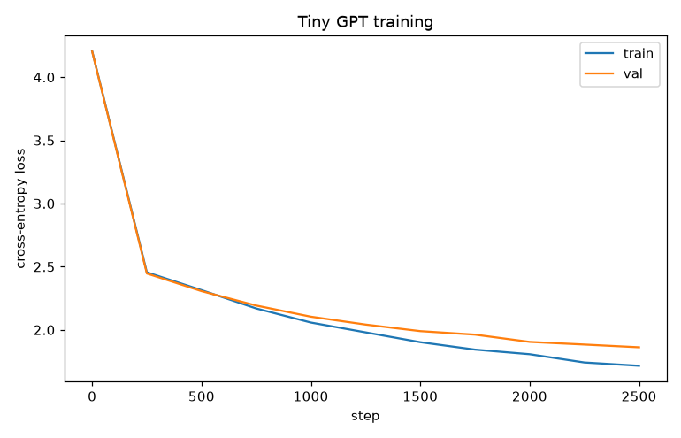

# Tiny GPT From Scratch — Self-Attention, Built by Hand

> **AI Engineer Roadmap — Project 3.2**
> *Teaches: attention mechanics, why LLMs work, the actual architecture instead of the metaphor.*
> *Done when: you can explain self-attention to someone without using the word "magic."*

A character-level GPT implemented from scratch in PyTorch — **multi-head causal
self-attention, learned positional embeddings, residual pre-norm blocks, weight
tying** — written out by hand (no `nn.MultiheadAttention`). It trains on
tiny-shakespeare and generates Shakespeare-ish text.

```bash
python -m venv .venv && source .venv/bin/activate   # Win: .\.venv\Scripts\activate
pip install -e ".[dev]"
python train.py --steps 3000        # train on data/input.txt, sample text
python train.py --steps 100         # quick smoke run
pytest -q                           # 8 tests, incl. causal-masking verification
```

---

## 🖥️ Web playground (React + Tailwind + FastAPI)

A literary text-generation playground ships with the project: give the model a
seed (e.g. `ROMEO:`), tune temperature / length / top-k, and watch it dream up new
Shakespeare-ish lines with a typewriter reveal. It loads a small committed
checkpoint (`web_model/gpt.pt`) so there's no training at request time.

```bash
pip install -e ".[web]"
uvicorn api:app --reload          # open http://localhost:8000

# (Re)build the checkpoint and frontend if you want:
python build_web_model.py         # trains a compact model -> web_model/gpt.pt
cd web && npm install && npm run build
```

The committed `web/dist` + `web_model/gpt.pt` mean `uvicorn api:app` works from a
clone with no build or training.

## Self-attention without the word "magic"

For every token, three vectors are produced by linear projection:

- **query (q)** — *what am I looking for?*
- **key (k)** — *what do I offer?*
- **value (v)** — *what will I contribute if attended to?*

The score from token *i* to token *j* is the dot product `q_i · k_j` — how well
*i*'s query matches *j*'s key. Then:

1. **Scale** by `1/√(head_dim)` so scores don't grow with dimension.
2. **Causal mask**: set scores for future tokens (`j > i`) to `−∞`, so a token
   can only look backward — essential for next-token prediction.
3. **Softmax** over *j* → attention weights that sum to 1.
4. **Weighted sum of values** → each token's new representation mixes in the
   earlier tokens it found relevant.

Run several of these in parallel (**heads**) and stack several **layers**, with an
MLP and residual connections in between, and that is a GPT. The code in
`src/minigpt/model.py` is annotated line-by-line to match this description.

**Positional embeddings**: attention is permutation-invariant — on its own it
can't tell "dog bites man" from "man bites dog". We add a learned vector per
position so word order is encoded.

---

## Results

Trained on tiny-shakespeare (~1.1M chars, vocab 65) on CPU:

- **Model:** 4 layers, 4 heads, 128-dim embeddings → **809,856 parameters**
- **Training:** 2,500 steps, block size 64, CPU only
- **Validation loss:** 4.17 (random) → **1.86** (cross-entropy per character)

A sample generated from the trained model (`reports/sample.txt`):

```
GHENRY YOMBRK:
OW:
Thou so the warwand lest bessee God farge, armo have; and
am be whos that thou to llowerlly, and comown.

RAMENIX:
I dlay, in anot your baing and king to o'e the but:
I n done shard them, would, Who gee?

PENIUS:
Where my aragand the barials, a hy do lady!
```

From a random-character start, the model has learned **the structure of a
Shakespeare play** entirely on its own: uppercase CHARACTER names followed by a
colon, line breaks, dialogue, punctuation, and English-like word shapes — at just
0.8M parameters and a few minutes of CPU training. The words aren't real English
yet (that needs a bigger model / more steps / a GPU), but the *form* is
unmistakable, which is the point: next-character prediction alone induces
grammar-like structure.



Validation loss falls steadily; samples progress from random characters →
English-like words → Shakespeare-formatted dialogue as training continues.

---

## Correctness: the causal-mask test

The most important test (`tests/test_minigpt.py::test_causal_mask_no_future_leakage`)
proves the model never peeks at the future: it changes the **last** input token
and asserts the logits at every **earlier** position are byte-for-byte unchanged,
while the last position's logits *do* change. If a transformer fails this, it's
secretly cheating during training and useless for generation. Other tests cover
softmax weights summing to 1, weight tying, next-token target alignment, and the
model overfitting a single batch.

## Architecture

```
GPT
├── token embedding  +  positional embedding        (src/minigpt/model.py)
├── N x Block
│    ├── LayerNorm -> CausalSelfAttention -> + residual
│    └── LayerNorm -> MLP (4x, GELU)       -> + residual
├── final LayerNorm
└── linear head  (weights tied to token embedding)
```

```
src/minigpt/
├── model.py   # GPTConfig, CausalSelfAttention, MLP, Block, GPT (+ generate)
└── data.py    # CharTokenizer + CharDataset (next-char batches)
train.py        # training loop, loss curve, text sampling
data/input.txt  # tiny-shakespeare corpus (public domain)
tests/          # 8 tests incl. causal-masking verification
```

## License

MIT. tiny-shakespeare is public-domain text.
